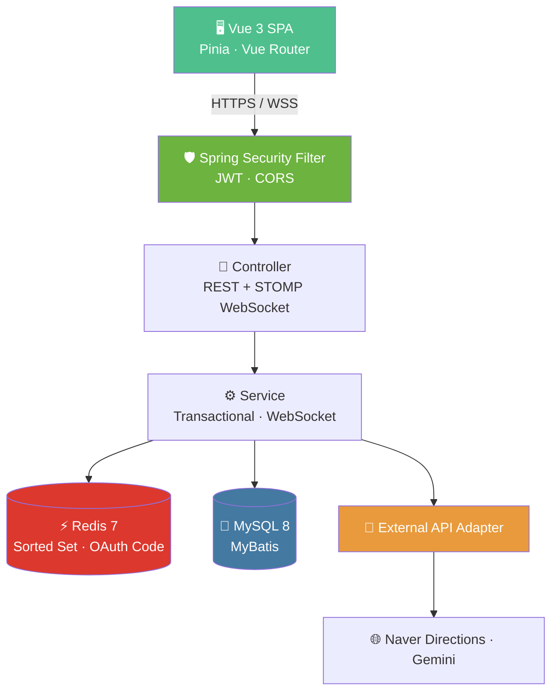
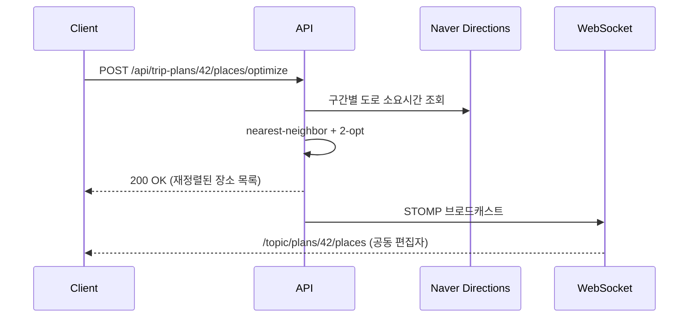

<div align="center">

# 🧳 TripCrew

### 함께 만드는 여행 계획 플랫폼

공공데이터로 정확하게 · 챗봇으로 빠르게 · 동선 최적화로 효율적으로

<br/>


<br/>

[](https://tripcrew.duckdns.org)

<br/>


</div>

<br/>

---

<div align="center">

### 🎯 채용담당자님, 바로 체험해보세요

로그인 페이지의 **「데모 계정으로 바로 로그인」** 버튼을 누르면 입력 없이 한 번에 접속되어<br/>
여행 계획 · 공동 편집 · 챗봇 · 관광지 검색 · 후기 등 전체 기능을 둘러볼 수 있습니다.

🔗 **[tripcrew.duckdns.org](https://tripcrew.duckdns.org)**

| 이메일 | 비밀번호 |
|---|---|
| `demo@tripcrew.kr` | `tripcrew1234` |

</div>

<br/>

---

## 📌 프로젝트 개요

**TripCrew**는 여행 계획을 짜기 귀찮거나 어려운 사용자에게 편리하고 특색 있는 맞춤형 여행 계획을 제안하는 서비스입니다. 혼자서도, 친구와 함께서도 짤 수 있는 협업형 여행 계획 플랫폼을 지향합니다.

### ✨ 차별점

| | |
|---|---|
| 🤖 **하이브리드 추천** | 챗봇 자연어 입력 + 직접 필터링 선택을 모두 지원 |
| 🗺️ **동선 최적화** | TSP 근사 알고리즘 기반 효율적 이동 경로 제안 |
| 👥 **공동 편집** | 친구와 함께 실시간으로 여행 계획 편집 |
| 📊 **공공데이터 기반** | 한국관광공사 TourAPI를 활용한 신뢰성 있는 정보 |

> 단순 CRUD를 넘어 **쿼리 성능 최적화 · 데이터 정합성 · 외부 API 장애 처리 · 실시간 동기화** 등 실무 도전 과제를 도메인에 녹인, 2인 팀 프로젝트입니다.

<br/>

---

## 🛠 기술 스택

### Backend

| 구분 | 기술 |
|---|---|
| Language | Java 17 |
| Framework | Spring Boot 3.2.5 |
| Persistence | MyBatis · MySQL 8 |
| Cache / Ranking | Redis 7 (Sorted Set 실시간 랭킹 · OAuth 코드 핸드오프) |
| Security | Spring Security · JWT (Access · Refresh Token) · OAuth2 Client (Kakao · Naver) |
| Real-time | WebSocket (STOMP) |

### Frontend

| 구분 | 기술 |
|---|---|
| Framework | Vue 3 (Composition API) |
| Build | Vite 5 |
| Routing | Vue Router 4 |
| State | Pinia |
| Style | Plain CSS · CSS Variables |

### Infra & DevOps

| 구분 | 기술 |
|---|---|
| Build | Maven |
| Container | Docker · Docker Compose |
| Deploy | AWS EC2 · Docker Compose · Caddy (HTTPS Reverse Proxy) |
| Monitoring | 커스텀 헬스 체크 `/api/health` (앱 · 외부 API 상태) · Prometheus/Grafana *(예정)* |

### External APIs

한국관광공사 **TourAPI**(관광지 공공데이터) · **Naver Maps**(지도 · Directions 동선 최적화) · **Gemini API**(챗봇)

<br/>

---

## 🎯 핵심 기능

| ID | 분류 | 기능 | 우선순위 |
|:---:|:---:|---|:---:|
| F01 | 회원 | 회원가입, 로그인(이메일 + 카카오·네이버 소셜 로그인), 정보 수정, 탈퇴 | 필수 |
| F02 | 여행 | 지역별 관광지 조회 (캐싱) | 필수 |
| F03 | 여행 | 여행 계획 CRUD | 필수 |
| F04 | 여행 | 동선 최적화 (TSP 2-opt · Naver Directions) | 필수 |
| F05 | 여행 | 챗봇 기반 추천 | 추가 |
| F06 | 여행 | 여행 계획 공동 편집 | 추가 |
| F07 | 여행 | 인기 관광지 실시간 랭킹 | 추가 |
| F08 | 여행 | 여행 후기 + 평점 + 이미지 업로드 | 추가 |
| F09 | 관리 | 관리자 페이지 (회원 관리, 신고 처리) | 필수 |
| F10 | 공통 | 공지사항 | 필수 |

<br/>

---

## 🏗 시스템 아키텍처



<br/>

---

## 💡 백엔드 핵심 시나리오

각 시나리오는 실제 화면(UI)에 시각적으로 반영되어 있습니다.

### 시나리오 A · 관광지 데이터 & 검색

한국관광공사 TourAPI 공공데이터(약 5만 건)를 MySQL에 적재하고 **FULLTEXT 인덱스**로 지역·키워드 검색을 제공합니다. 관광지 조회 이벤트는 Redis Sorted Set에 집계되어 실시간 랭킹(→ 시나리오 E)으로 이어집니다.

### 시나리오 B · 동시성 제어 (낙관적 락)

공동 편집 시 `version` 컬럼 기반 낙관적 락을 적용합니다. 두 사용자가 동시에 같은 일정을 수정하면 **HTTP 409 Conflict**를 응답하고, 충돌 UI에서 "최신 불러오기 / 내 변경 유지"를 선택할 수 있습니다.

```sql
UPDATE trip_plans
   SET ..., version = version + 1
 WHERE id = ? AND version = ?   -- 보낸 version이 일치할 때만 UPDATE (affected 0 = 409)
```

### 시나리오 C · 동선 최적화 (TSP 2-opt + WebSocket 브로드캐스트)

여러 목적지의 방문 순서를 nearest-neighbor + 2-opt로 최적화합니다. Naver Directions로 실제 도로 소요시간을 받아 이동시간 기준으로 재정렬하고, 완료 후 공동 편집자들에게 WebSocket(STOMP)으로 변경을 브로드캐스트합니다.



### 시나리오 D · 실시간 협업 (WebSocket · STOMP)

공동 편집 중 접속자 프레즌스와 장소 변경을 WebSocket(STOMP)으로 실시간 동기화합니다. *(현재 단일 인스턴스 인메모리 브로커. 다중 인스턴스 확장 시 Redis Pub/Sub으로 교체 예정.)*

### 시나리오 E · 실시간 랭킹 (Redis Sorted Set)

관광지 조회/추가 이벤트마다 `ZINCRBY`로 점수를 증가시킵니다. RDBMS 집계 대비 **O(log N)** 갱신 성능을 확보합니다.

### 시나리오 F · 관리자 회원 조회 성능 최적화

관리자 페이지의 회원 목록 조회가 초기엔 전체 회원을 로드한 뒤 애플리케이션 메모리에서 필터·정렬·페이징하는 구조였습니다. 더미 데이터 30만 건에서 조회에 **0.473초**가 걸렸고, `EXPLAIN` 결과 풀 테이블 스캔(`type: ALL`)과 별도 정렬(`Using filesort`)이 병목이었습니다.

**서버 사이드 페이징 + `(role, created_at)` 복합 인덱스**로 전환해 정렬을 인덱스가 대신하도록 하고 `LIMIT`으로 조기 종료되게 했습니다. 그 결과 동일 조건에서 **0.473초 → 0.018초 (약 26배)**, `type`은 `ALL → ref`, `Using filesort`는 제거됨을 `EXPLAIN`으로 확인했습니다.

```sql
-- (role, created_at) 복합 인덱스로 정렬 비용 제거 + LIMIT 조기 종료
SELECT ... FROM users
 WHERE role = ?
 ORDER BY created_at DESC
 LIMIT ? OFFSET ?;
```

> `OFFSET`이 커질수록(10만 이상) 앞 행을 모두 세고 버리는 비용 때문에 다시 느려지는 것을 확인했고, 대용량 페이징의 근본 해법은 커서(키셋) 페이징임을 실측으로 파악했습니다.

<br/>

---

## 🖼 주요 화면

> Vue 3 화면 25개 + REST · WebSocket API 연동 완료. (아래는 대표 화면)

| 화면 | 경로 | 관련 시나리오 |
|---|---|---|
| 랜딩 페이지 | `/` | 인기 랭킹 (Redis ZSet) |
| 회원가입 / 로그인 | `/auth` | JWT 발급 |
| 메인 대시보드 | `/home` | 추천 + 활동 피드 |
| AI 챗봇 | `/chat` | Gemini API |
| 관광지 검색 | `/attractions` | FULLTEXT 검색 + 스켈레톤 |
| 관광지 상세 | `/attractions/:id` | 네이버 지도 + 최근 후기 |
| 여행 계획 편집 | `/plans/:id/edit` | 동선 최적화 (2-opt) |
| **공동 편집** | `/plans/:id/edit` | WebSocket + 낙관적 락 |
| 내 계획 리스트 | `/plans` | 페이지네이션 |
| 후기 작성 / 조회 | `/attractions/:id/reviews` | 로컬 파일시스템 업로드 |
| 관리자 페이지 | `/admin/users` | ADMIN 권한 · 회원 조회 최적화(시나리오 F) |
| 에러 / 빈 상태 | `/errors/:type` | 403 / 404 / 오프라인 |

<!-- ────────────────────────────────────────────────
     TODO: 데모 GIF를 만든 뒤 아래 주석을 푸세요.
     추천 툴: ScreenToGif(Windows) / LICEcap(Mac·Windows)
     녹화 대상: 동선 최적화 모달, 공동 편집 충돌 모달
──────────────────────────────────────────────── -->
<!--
### 🎬 데모

**동선 최적화 (비동기 처리)**


**공동 편집 충돌 (낙관적 락)**


-->

<br/>

---

## 📅 개발 로드맵

| 주차 | 기간 | 주요 작업 | 상태 |
|:---:|---|---|:---:|
| 1주차 | 2026.05.18 ~ 05.22 | 기획, 요구사항 명세, WBS, 화면 설계 | ✅ |
| 2주차 | 2026.05.25 ~ 05.29 | Vue 프론트엔드 12개 화면, 디자인 시스템 | ✅ |
| 3주차 | 2026.06.01 ~ 06.05 | DB 설계(ERD), 기본 CRUD(F01~F03), 인증 | ✅ |
| 4주차 | 2026.06.08 ~ 06.12 | 관광지·동선·공동 편집, 통합 테스트 | ✅ |
| 이후 | 2026.06 ~ 07 | 운영 배포(AWS EC2 · HTTPS) · 소셜 로그인 · 실시간 협업 고도화 | ✅ |

<br/>

---

## 📂 프로젝트 구조

```
tripcrew/
├── tripcrew-backend/      # Spring Boot 백엔드
│
├── tripcrew-frontend/     # Vue 3 프론트엔드
│   └── src/
│       ├── views/         # 화면 컴포넌트 (25개)
│       ├── components/    # 공통 컴포넌트
│       ├── router/        # Vue Router 설정
│       └── assets/styles/ # 디자인 토큰
│
├── docs/                  # 산출물 (ERD, API 명세, 이미지 등)
│
└── README.md
```

<br/>

---

## 🚀 실행 방법

### 사전 요구사항

`JDK 17` · `MySQL 8` · `Redis 7` · `Node.js 18+`

### Frontend *(현재 실행 가능)*

```bash
cd tripcrew-frontend
npm install
npm run dev
# → http://localhost:5173
```

### Backend *(현재 실행 가능)*

```bash
cd tripcrew-backend
./mvnw spring-boot:run
# → http://localhost:8080
```

### Docker Compose (권장)

MySQL · 백엔드 · 프론트를 한 번에 컨테이너로 띄운다. Docker 엔진은 Docker Desktop 또는 colima 중 택1.

```bash
# 1) 시크릿 준비 (.env 는 gitignore — 커밋 금지)
cp .env.example .env
#    .env 에서 최소 DB_PASSWORD / JWT_SECRET / GEMINI_API_KEY 채우기
#    JWT_SECRET 예: openssl rand -base64 32

# 2) 빌드 + 기동
docker compose up -d --build
#    backend  → http://localhost:8080  (/api/health 로 확인, Flyway 가 스키마 자동 생성)
#    frontend → http://localhost:5173
#    mysql    → localhost:${MYSQL_PORT:-3306} (컨테이너 내부는 mysql:3306)
```

> ⚠️ 셸(`~/.zshrc`)에 `DB_PASSWORD` 를 export 해 두면 compose 치환에서 `.env` 보다 **우선**한다.
> mysql 과 백엔드 모두 `DB_PASSWORD` 한 소스로 초기화하므로 값이 같이 바뀌어 불일치는 없지만,
> 컨테이너 DB 는 그 값으로 초기화된다. 비번을 바꾸면 `docker compose down -v` 후 재기동(볼륨 재생성).

### 운영 배포 *(라이브)*

AWS EC2에 `docker-compose.prod.yml` + **Caddy**(리버스 프록시 · HTTPS 자동 발급)로 배포되어 있습니다.

🔗 **라이브 데모 — [tripcrew.duckdns.org](https://tripcrew.duckdns.org)**

<br/>

---

## 👥 팀원

| 이름 | 역할 | GitHub | 담당 영역 |
|---|:---:|---|---|
| **이정현** | 팀장 | [@jhyungit](https://github.com/jhyungit) | 인증 · 캐싱 · 공동 편집 · 관리자 페이지(회원 조회 성능 최적화) · ERD |
| **고용훈** | 팀원 | [@ita010](https://github.com/ita010) | 동선 최적화 · 챗봇 · 관광지 조회 최적화 · 인프라 |

<br/>

---

## 📄 저작권 및 데이터 출처

이 프로젝트는 학습 목적의 비상업적 프로젝트입니다.
공공데이터는 각 기관의 이용약관을 따릅니다.

- 한국관광공사 TourAPI — 공공누리 제1유형

<br/>

<div align="center">

**TripCrew** · 2026

</div>
