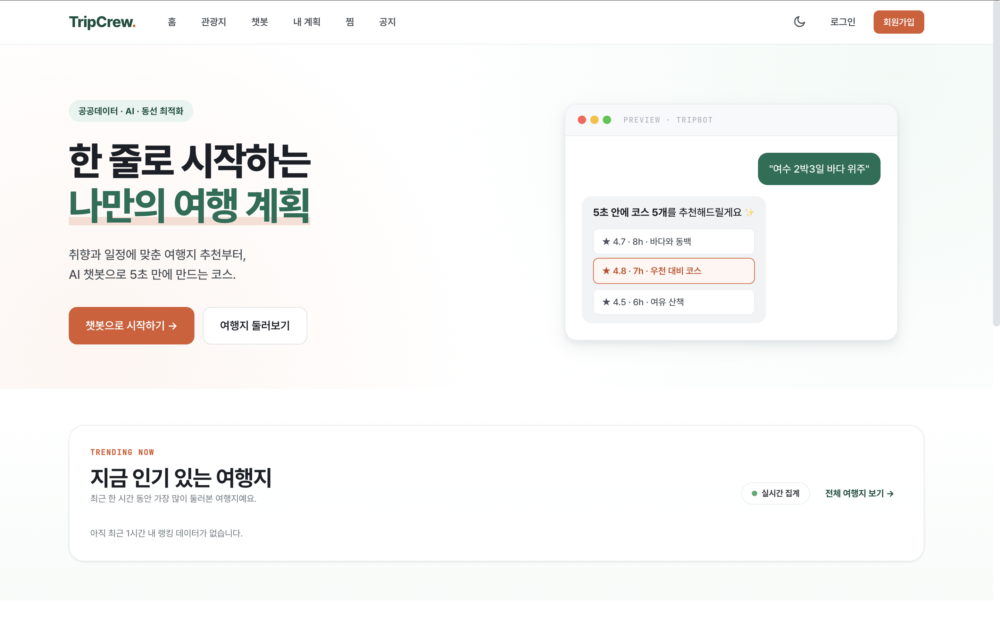
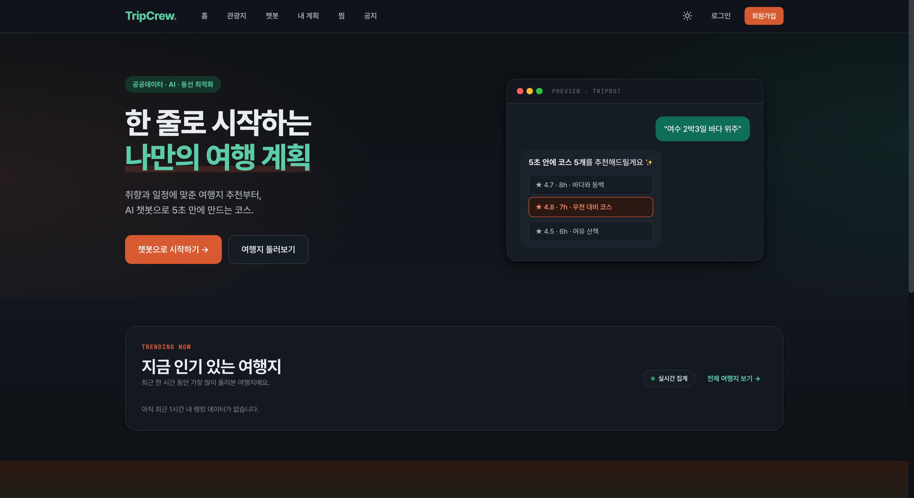
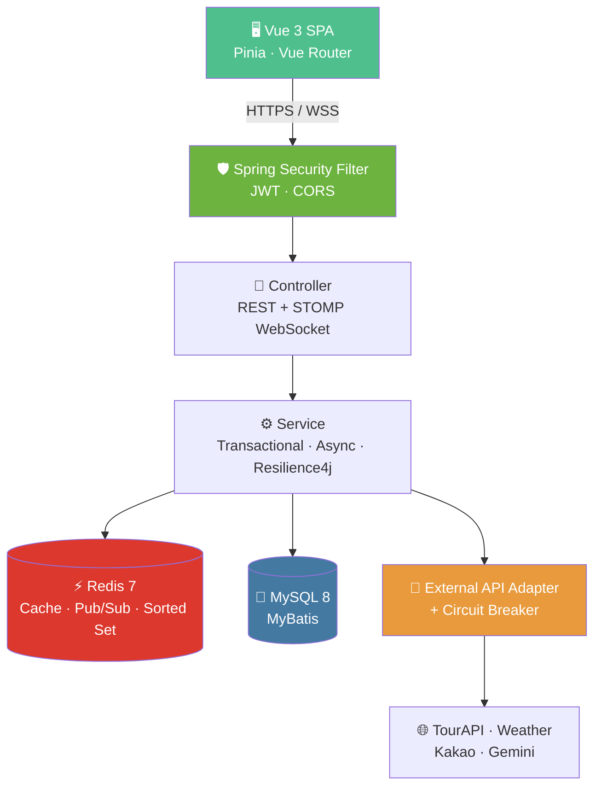
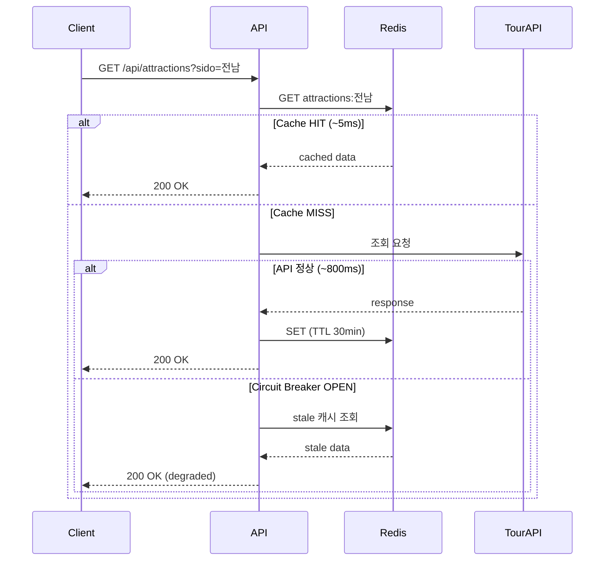
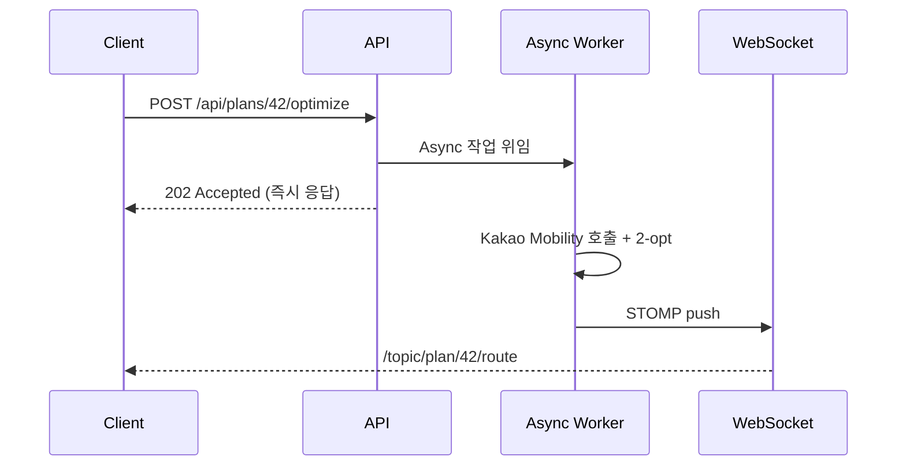

<div align="center">

# 🧳 TripCrew

### 함께 만드는 여행 계획 플랫폼

공공데이터로 정확하게 · 챗봇으로 빠르게 · 동선 최적화로 효율적으로

<br/>




<br/>


</div>

<br/>

---

## 📌 프로젝트 개요

**TripCrew**는 여행 계획을 짜기 귀찮거나 어려운 사용자에게 편리하고 특색 있는 맞춤형 여행 계획을 제안하는 서비스입니다. 혼자서도, 친구와 함께서도 짤 수 있는 협업형 여행 계획 플랫폼을 지향합니다.

### ✨ 차별점

| | |
|---|---|
| 🤖 **하이브리드 추천** | 챗봇 자연어 입력 + 직접 필터링 선택을 모두 지원 |
| 🗺️ **동선 최적화** | TSP 근사 알고리즘 기반 효율적 이동 경로 제안 |
| 👥 **공동 편집** | 친구와 함께 실시간으로 여행 계획 편집 |
| 📊 **공공데이터 기반** | 한국관광공사 TourAPI를 활용한 신뢰성 있는 정보 |

> 단순 CRUD를 넘어 **트래픽 대응 · 외부 API 장애 처리 · 데이터 정합성 · 실시간 동기화** 등 실무 도전 과제를 도메인에 녹인 백엔드 학습용 4주 캡스톤 프로젝트입니다.

<br/>

---

## 🛠 기술 스택

### Backend

| 구분 | 기술 |
|---|---|
| Language | Java 17 |
| Framework | Spring Boot 3.3.x |
| Persistence | MyBatis · MySQL 8 |
| Cache / Pub-Sub | Redis 7 |
| Security | Spring Security · JWT (Refresh Token Rotation) |
| Resilience | Resilience4j (Circuit Breaker · Retry · TimeLimiter) |
| Real-time | WebSocket (STOMP) · Redis Pub/Sub |

### Frontend

| 구분 | 기술 |
|---|---|
| Framework | Vue 3 (Composition API) |
| Build | Vite 5 |
| Routing | Vue Router 4 |
| State | Pinia *(API 연동 시 도입)* |
| Style | Plain CSS · CSS Variables |

### Infra & DevOps

| 구분 | 기술 |
|---|---|
| Build | Maven |
| Container | Docker · Docker Compose |
| Monitoring | Spring Actuator · Prometheus · Grafana *(예정)* |

### External APIs

한국관광공사 **TourAPI** · **OpenWeatherMap** · **한국천문연구원**(일출/일몰) · **한국환경공단**(전기차 충전소) · **Kakao Mobility** · **Gemini API**

<br/>

---

## 🎯 핵심 기능

| ID | 분류 | 기능 | 우선순위 |
|:---:|:---:|---|:---:|
| F01 | 회원 | 회원가입, 로그인, 정보 수정, 탈퇴 | 필수 |
| F02 | 여행 | 지역별 관광지 조회 (캐싱) | 필수 |
| F03 | 여행 | 여행 계획 CRUD | 필수 |
| F04 | 여행 | 동선 최적화 (비동기 + TSP 2-opt) | 필수 |
| F05 | 여행 | 챗봇 기반 추천 | 추가 |
| F06 | 여행 | 여행 계획 공동 편집 | 추가 |
| F07 | 여행 | 인기 관광지 실시간 랭킹 | 추가 |
| F08 | 여행 | 여행 후기 + 평점 + 이미지 업로드 | 추가 |
| F09 | 관리 | 관리자 페이지 (회원 관리, 신고 처리) | 필수 |
| F10 | 공통 | 공지사항 | 필수 |

<br/>

---

## 🏗 시스템 아키텍처



<br/>

---

## 💡 백엔드 핵심 시나리오

각 시나리오는 실제 화면(UI)에 시각적으로 반영되어 있습니다.

### 시나리오 A · 캐싱 전략 (Cache-Aside + Circuit Breaker)

관광지 조회 시 Redis 캐시를 우선 조회하고, MISS 시 외부 API를 호출해 응답을 캐싱합니다. 외부 API 장애 시 Circuit Breaker가 stale 캐시로 graceful degradation을 수행합니다.



### 시나리오 B · 동시성 제어 (낙관적 락)

공동 편집 시 `version` 컬럼 기반 낙관적 락을 적용합니다. 두 사용자가 동시에 같은 일정을 수정하면 **HTTP 409 Conflict**를 응답하고, 충돌 UI에서 머지 옵션을 제공합니다.

```sql
UPDATE travel_plans
   SET ..., version = version + 1
 WHERE id = ? AND version = ?   -- 보낸 version이 일치할 때만 UPDATE
```

### 시나리오 C · 비동기 처리 (@Async + WebSocket)

동선 최적화는 톰캣 스레드를 점유하지 않도록 비동기로 처리하고, 완료 시 WebSocket으로 결과를 푸시합니다.



### 시나리오 D · 실시간 협업 (WebSocket + Redis Pub/Sub)

멀티 인스턴스 환경에서 사용자들이 서로 다른 서버에 연결되어 있어도 Redis Pub/Sub으로 편집 내용을 브로드캐스트합니다.

### 시나리오 E · 실시간 랭킹 (Redis Sorted Set)

관광지 조회/추가 이벤트마다 `ZINCRBY`로 점수를 증가시킵니다. RDBMS 집계 대비 **O(log N)** 갱신 성능을 확보합니다.

<br/>

---

## 🖼 주요 화면

> Vue 3 정적 화면 12개 구현 완료. API 연동은 다음 단계입니다.

| 화면 | 경로 | 관련 시나리오 |
|---|---|---|
| 랜딩 페이지 | `/` | 인기 랭킹 (Redis ZSet) |
| 회원가입 / 로그인 | `/auth` | JWT 발급 |
| 메인 대시보드 | `/home` | 추천 + 활동 피드 |
| AI 챗봇 | `/chat` | Gemini API |
| 관광지 검색 | `/attractions` | Cache-Aside + 스켈레톤 |
| 관광지 상세 | `/attractions/:id` | 다중 외부 API |
| 여행 계획 편집 | `/plans/:id/edit` | @Async 동선 최적화 |
| **공동 편집** | `/plans/:id/co` | WebSocket + 낙관적 락 |
| 내 계획 리스트 | `/plans` | 페이지네이션 |
| 후기 작성 / 조회 | `/attractions/:id/reviews` | S3 업로드 |
| 관리자 페이지 | `/admin/users` | ADMIN 권한 |
| 에러 / 빈 상태 | `/errors/:type` | Circuit Breaker UI |

<!-- ────────────────────────────────────────────────
     TODO: 데모 GIF를 만든 뒤 아래 주석을 푸세요.
     추천 툴: ScreenToGif(Windows) / LICEcap(Mac·Windows)
     녹화 대상: 동선 최적화 모달, 공동 편집 충돌 모달
──────────────────────────────────────────────── -->
<!--
### 🎬 데모

**동선 최적화 (비동기 처리)**


**공동 편집 충돌 (낙관적 락)**


-->

<br/>

---

## 📅 개발 로드맵

| 주차 | 기간 | 주요 작업 | 상태 |
|:---:|---|---|:---:|
| 1주차 | 2026.05.18 ~ 05.22 | 기획, 요구사항 명세, WBS, 화면 설계 | ✅ |
| 2주차 | 2026.05.25 ~ 05.29 | Vue 프론트엔드 12개 화면, 디자인 시스템 | ✅ |
| 3주차 | 2026.06.01 ~ 06.05 | DB 설계(ERD), 기본 CRUD(F01~F03), 인증 | 🚧 |
| 4주차 | 2026.06.08 ~ 06.12 | 캐싱·동선·공동 편집, 통합 테스트, 발표 | 📅 |

<br/>

---

## 📂 프로젝트 구조

```
tripcrew/
├── tripcrew-backend/      # Spring Boot 백엔드 (작업 예정)
│
├── tripcrew-frontend/     # Vue 3 프론트엔드 (정적 화면 완성)
│   └── src/
│       ├── views/         # 12개 화면 (SC-01 ~ SC-12)
│       ├── components/    # 공통 컴포넌트
│       ├── router/        # Vue Router 설정
│       └── assets/styles/ # 디자인 토큰
│
├── docs/                  # 산출물 (ERD, API 명세, 이미지 등)
│
└── README.md
```

<br/>

---

## 🚀 실행 방법

### 사전 요구사항

`JDK 17` · `MySQL 8` · `Redis 7` · `Node.js 18+`

### Frontend *(현재 실행 가능)*

```bash
cd tripcrew-frontend
npm install
npm run dev
# → http://localhost:5173
```

### Backend *(준비 중)*

```bash
cd tripcrew-backend
./mvnw spring-boot:run
# → http://localhost:8080
```

### Docker Compose (권장)

MySQL · 백엔드 · 프론트를 한 번에 컨테이너로 띄운다. Docker 엔진은 Docker Desktop 또는 colima 중 택1.

```bash
# 1) 시크릿 준비 (.env 는 gitignore — 커밋 금지)
cp .env.example .env
#    .env 에서 최소 DB_PASSWORD / JWT_SECRET / GEMINI_API_KEY 채우기
#    JWT_SECRET 예: openssl rand -base64 32

# 2) 빌드 + 기동
docker compose up -d --build
#    backend  → http://localhost:8080  (/api/health 로 확인, Flyway 가 스키마 자동 생성)
#    frontend → http://localhost:5173
#    mysql    → localhost:${MYSQL_PORT:-3306} (컨테이너 내부는 mysql:3306)
```

> ⚠️ 셸(`~/.zshrc`)에 `DB_PASSWORD` 를 export 해 두면 compose 치환에서 `.env` 보다 **우선**한다.
> mysql 과 백엔드 모두 `DB_PASSWORD` 한 소스로 초기화하므로 값이 같이 바뀌어 불일치는 없지만,
> 컨테이너 DB 는 그 값으로 초기화된다. 비번을 바꾸면 `docker compose down -v` 후 재기동(볼륨 재생성).

<br/>

---

## 👥 팀원

| 이름 | 역할 | GitHub | 담당 영역 |
|---|:---:|---|---|
| **이정현** | 팀장 | [@jhyungit](https://github.com/jhyungit) | 인증 · 캐싱 · 공동 편집 · ERD |
| **고용훈** | 팀원 | [@ita010](https://github.com/ita010) | 동선 최적화 · 챗봇 · 인프라 |

<br/>

---

## 📄 저작권 및 데이터 출처

이 프로젝트는 학습 목적의 비상업적 프로젝트입니다.
공공데이터는 각 기관의 이용약관을 따릅니다.

- 한국관광공사 TourAPI — 공공누리 제1유형
- 한국환경공단 — 공공누리 제1유형
- 한국천문연구원 — 공공누리 제1유형

<br/>

<div align="center">

**TripCrew** · 2026

</div>
