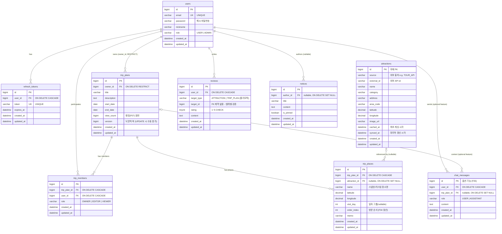

# TripCrew ERD

> Spring Boot 3.3 + MySQL 8 + MyBatis 기준 데이터 모델.
> 표기는 Mermaid `erDiagram`. 자세한 설계 근거는 [db-design-notes.md](./db-design-notes.md), DDL은 [db/schema.sql](./db/schema.sql) 참고.

## 다이어그램

## 폴리모픽 관계 주의

`reviews`는 `target_type` + `target_id`로 `attractions` 또는 `trip_plans`을 가리키는 폴리모픽 구조다.
대상이 둘이라 DB FK 제약을 걸 수 없으므로 ERD 상에서도 연결선을 그리지 않았다.
유효성/삭제 정합성은 애플리케이션 레이어에서 보장한다. (상세: [db-design-notes.md](./db-design-notes.md))
