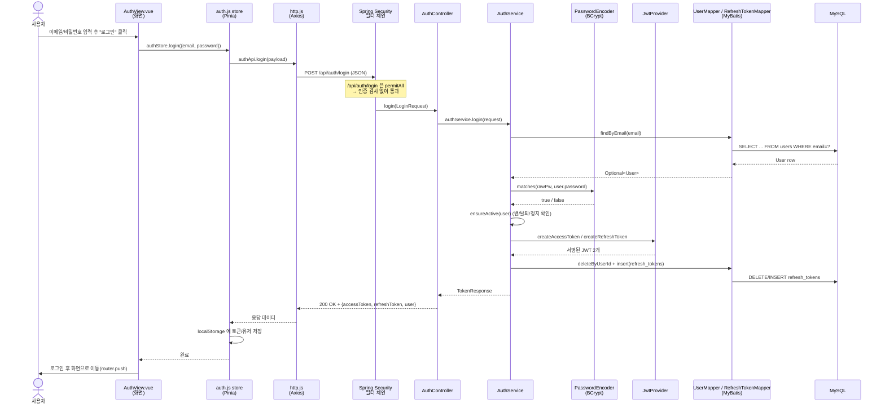
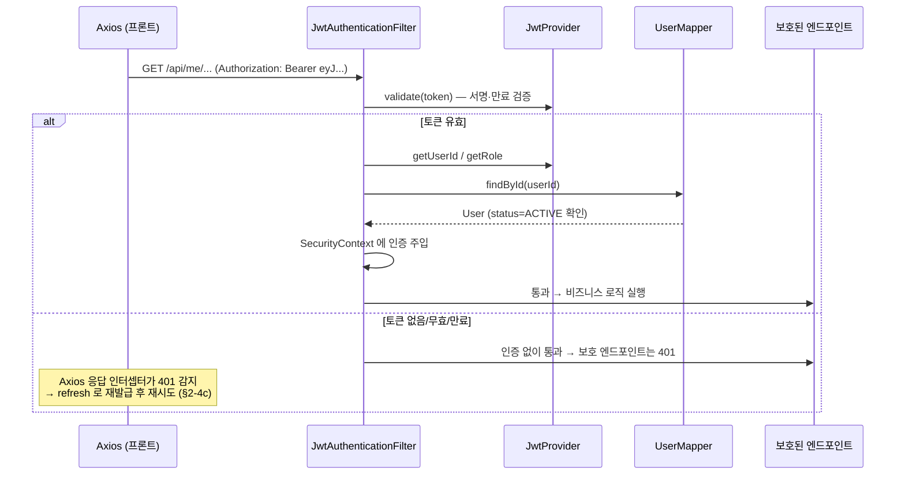

# 로그인 요청 1건 따라가기 — Client → Server → DB

> **목적**: TripCrew에서 "로그인 버튼을 누르면" 실제로 무슨 일이 벌어지는지를
> Vue(프론트) → Spring Boot(백엔드) → MySQL(DB) 까지 **요청 1건의 흐름**으로 끝까지 추적한다.
> 각 단계마다 **실제 코드 위치(파일·줄번호)** 를 링크로 달아 두었으니, 글을 읽으며 코드를 같이 열어 보면 된다.
>
> 대상 흐름: **이메일 + 비밀번호(LOCAL) 로그인** (소셜 로그인은 별도 문서/메모 참고)
> 기준 브랜치: `main`

---

## 0. 큰 그림 — 3계층 아키텍처

```
┌─────────────────────────┐     HTTP/JSON      ┌──────────────────────────┐    JDBC/SQL    ┌──────────────┐
│   CLIENT (브라우저)       │  ───────────────▶ │   SERVER (Spring Boot)    │ ─────────────▶ │   DB (MySQL) │
│   Vue 3 + Pinia + Axios  │  ◀─────────────── │   Spring Security + MyBatis│ ◀───────────── │   InnoDB     │
└─────────────────────────┘     토큰 응답       └──────────────────────────┘    조회 결과     └──────────────┘
      :5173 (Vite)                                    :8080                          :3306 (컨테이너 3307)
```

- **Client**: 화면(Vue 컴포넌트) + 상태관리(Pinia store) + HTTP 통신(Axios). 토큰을 `localStorage`에 보관.
- **Server**: 요청을 받는 REST 컨트롤러 → 비즈니스 로직(Service) → DB 접근(MyBatis Mapper). 그 앞단에 **Spring Security 필터**가 인증/인가를 처리.
- **DB**: `users`(회원), `refresh_tokens`(리프레시 토큰) 테이블. Flyway로 스키마 관리.

핵심 키워드: **JWT 토큰 기반 인증**, **Stateless(세션 없음)**, **BCrypt 비밀번호 해시**, **MyBatis(SQL 직접 매핑)**.

---

## 1. 전체 흐름 한눈에 (시퀀스 다이어그램)



---

## 2. CLIENT — 프론트엔드 (Vue 3)

### 2-1. 화면: 로그인 폼 제출
**파일**: [tripcrew-frontend/src/views/AuthView.vue](../tripcrew-frontend/src/views/AuthView.vue#L141)

- `<form @submit.prevent="handleLogin">` ([L141](../tripcrew-frontend/src/views/AuthView.vue#L141)) — 폼 제출 시 페이지 새로고침을 막고(`prevent`) `handleLogin()` 호출.
- 입력값은 `loginForm` 객체(`{ email, password }`)에 `v-model`로 양방향 바인딩 ([L147](../tripcrew-frontend/src/views/AuthView.vue#L147), [L237](../tripcrew-frontend/src/views/AuthView.vue#L237)).

```js
// AuthView.vue L324
async function handleLogin() {
  loginError.value = ''
  isSubmitting.value = true
  try {
    await authStore.login(loginForm)          // ← store 의 login 액션 호출
    router.push(getRedirectTarget())          // 성공 시 화면 이동
  } catch (error) {
    loginError.value = getErrorMessage(error, '이메일 또는 비밀번호를 확인해주세요.')
  } finally {
    isSubmitting.value = false
  }
}
```

> **포인트**: 화면은 "무엇을 할지"만 안다. 실제 통신/저장은 **store에 위임**한다. (관심사 분리)

### 2-2. 상태관리: Pinia store
**파일**: [tripcrew-frontend/src/stores/auth.js](../tripcrew-frontend/src/stores/auth.js#L48)

```js
// auth.js L48
async function login(credentials) {
  return setSession(await authApi.login(credentials))   // API 호출 → 응답을 세션에 반영
}

// auth.js L40 — 토큰 응답을 로컬 세션에 저장(이메일/소셜 로그인 공통)
function setSession(tokens) {
  tokenStorage.set(tokens.accessToken, tokens.refreshToken) // localStorage 저장
  accessToken.value = tokens.accessToken                    // 반응형 상태 갱신
  user.value = tokens.user || null
  writeStoredUser(user.value)                               // 유저 정보도 localStorage
  return tokens
}
```

- `accessToken`/`user`는 `ref`(반응형) — 값이 바뀌면 헤더의 로그인 상태 등 화면이 자동 갱신.
- `isAuthenticated`는 `computed(() => !!accessToken.value)` ([L33](../tripcrew-frontend/src/stores/auth.js#L33)) — 토큰 유무로 로그인 여부 판단.

### 2-3. API 호출 계층
**파일**: [tripcrew-frontend/src/api/auth.js](../tripcrew-frontend/src/api/auth.js#L10)

```js
// api/auth.js L10 — 백엔드 엔드포인트와 1:1 대응
login: (payload) => http.post('/auth/login', payload).then((r) => r.data),
```

### 2-4. HTTP 공통 설정 (Axios 인스턴스 + 인터셉터)
**파일**: [tripcrew-frontend/src/api/http.js](../tripcrew-frontend/src/api/http.js)

여기가 **프론트 인증의 심장부**다. 세 가지를 한다:

**(a) baseURL** ([L13](../tripcrew-frontend/src/api/http.js#L13), [L45](../tripcrew-frontend/src/api/http.js#L45))
```js
const baseURL = import.meta.env.VITE_API_BASE_URL || 'http://localhost:8080/api'
export const http = axios.create({ baseURL, headers: { 'Content-Type': 'application/json' } })
```
→ `http.post('/auth/login')` 의 실제 URL = `http://localhost:8080/api/auth/login`

**(b) 요청 인터셉터** — 모든 요청에 토큰 자동 첨부 ([L51](../tripcrew-frontend/src/api/http.js#L51))
```js
http.interceptors.request.use((config) => {
  const token = tokenStorage.getAccess()
  if (token) config.headers.Authorization = `Bearer ${token}`   // 로그인 이후의 요청들에 붙는다
  return config
})
```
> 로그인 요청 자체는 아직 토큰이 없으니 헤더가 안 붙는다. 이 코드는 **로그인 이후** 보호된 API를 부를 때 의미가 있다.

**(c) 응답 인터셉터** — 401(만료) 시 자동 재발급 후 재시도 ([L70](../tripcrew-frontend/src/api/http.js#L70))
```js
// 응답이 401 이고, 재시도 전이며, auth 호출이 아니면 → 토큰 재발급 시도
if (response?.status !== 401 || config?._retry || isAuthCall) return Promise.reject(error)
config._retry = true
refreshingPromise = refreshingPromise || reissueAccessToken()  // 동시 401 이어도 재발급은 1번만
const newAccessToken = await refreshingPromise
config.headers.Authorization = `Bearer ${newAccessToken}`
return http(config)                                            // 원래 요청 재시도
```

**토큰 저장소** ([L29~L43](../tripcrew-frontend/src/api/http.js#L29)) — `localStorage`를 단일 출처로 사용:
- `tripcrew.accessToken`, `tripcrew.refreshToken` (그리고 store가 `tripcrew.user`)

> **왜 localStorage?** 새로고침해도 유지되고, store와의 순환 import를 피하려고 토큰의 단일 출처로 둠.

---

## 3. 네트워크 경계를 넘는다

브라우저는 이제 다음을 서버로 보낸다:
```
POST http://localhost:8080/api/auth/login
Content-Type: application/json

{ "email": "trip@crew.kr", "password": "..." }
```

> **CORS**: 프론트(:5173)와 백엔드(:8080)는 출처(origin)가 다르다. 그래서 백엔드가
> `:5173`을 허용 출처로 명시해 둬야 브라우저가 응답을 받는다.
> → [SecurityConfig L132 `corsConfigurationSource()`](../tripcrew-backend/src/main/java/com/tripcrew/common/config/SecurityConfig.java#L132)
> (CLAUDE.md에 "프론트는 반드시 5173" 이라고 적힌 이유.)

---

## 4. SERVER — 백엔드 (Spring Boot)

### 4-1. 첫 관문: Spring Security 필터 체인
**파일**: [tripcrew-backend/.../common/config/SecurityConfig.java](../tripcrew-backend/src/main/java/com/tripcrew/common/config/SecurityConfig.java#L54)

요청은 컨트롤러에 닿기 **전에** 보안 필터를 먼저 지난다. 설정 핵심:

```java
.sessionManagement(s -> s.sessionCreationPolicy(SessionCreationPolicy.STATELESS)) // L61: 세션 안 씀
.authorizeHttpRequests(auth -> auth
    .requestMatchers("/api/auth/signup", "/api/auth/login", "/api/auth/reissue",
            "/api/auth/oauth/exchange").permitAll()   // L65: 로그인은 인증 없이 허용
    ...
    .anyRequest().authenticated())                    // L91: 나머지는 전부 인증 필요
.addFilterBefore(new JwtAuthenticationFilter(jwtProvider, userMapper),
        UsernamePasswordAuthenticationFilter.class);  // L103: JWT 필터 장착
```

- **로그인은 `permitAll`** ([L65](../tripcrew-backend/src/main/java/com/tripcrew/common/config/SecurityConfig.java#L65)) — 아직 토큰이 없는 사람도 들어와야 하니 당연.
- **STATELESS** ([L61](../tripcrew-backend/src/main/java/com/tripcrew/common/config/SecurityConfig.java#L61)) — 서버가 세션을 저장하지 않음. "누구인지"는 매 요청의 JWT로만 판단. (서버 확장에 유리)
- **BCryptPasswordEncoder 빈** ([L109](../tripcrew-backend/src/main/java/com/tripcrew/common/config/SecurityConfig.java#L109)) — 비밀번호 해시 비교에 쓰일 도구를 여기서 등록.

> JWT 필터([JwtAuthenticationFilter](../tripcrew-backend/src/main/java/com/tripcrew/auth/jwt/JwtAuthenticationFilter.java))도 이 요청을 지나지만, **로그인 요청엔 토큰이 없으므로 그냥 통과**시킨다. (이 필터는 §6에서 "로그인 이후" 요청을 다룰 때 진짜 일을 한다.)

### 4-2. 컨트롤러: 요청 받기
**파일**: [tripcrew-backend/.../auth/controller/AuthController.java](../tripcrew-backend/src/main/java/com/tripcrew/auth/controller/AuthController.java#L42)

```java
@PostMapping("/login")                       // 클래스에 @RequestMapping("/api/auth") → 합쳐서 POST /api/auth/login
public TokenResponse login(@Valid @RequestBody LoginRequest request) {
    return authService.login(request);       // 비즈니스 로직은 Service 에 위임
}
```

- `@RequestBody` → JSON 본문을 [LoginRequest](../tripcrew-backend/src/main/java/com/tripcrew/auth/model/dto/LoginRequest.java) record로 역직렬화.
- `@Valid` → `@NotBlank @Email` 등 검증 실행. 실패하면 컨트롤러 진입 전 400.

### 4-3. 서비스: 로그인 핵심 로직
**파일**: [tripcrew-backend/.../auth/service/AuthService.java](../tripcrew-backend/src/main/java/com/tripcrew/auth/service/AuthService.java#L65)

```java
// AuthService.java L65
@Transactional
public TokenResponse login(LoginRequest request) {
    User user = userMapper.findByEmail(request.email())          // ① DB 에서 이메일로 조회
            .orElseThrow(InvalidCredentialsException::new);      //    없으면 401
    if (user.getPassword() == null) {                            // ② 소셜 전용 계정은 비번 로그인 불가
        throw new InvalidCredentialsException();
    }
    if (!passwordEncoder.matches(request.password(), user.getPassword())) {  // ③ BCrypt 비교
        throw new InvalidCredentialsException();                 //    불일치면 401
    }
    ensureActive(user);                                          // ④ 밴/탈퇴/정지 확인
    return issueTokens(user);                                    // ⑤ 토큰 발급 + 저장
}
```

**① 사용자 조회** → §4-4 (MyBatis)

**② 소셜 전용 계정 방어**: 카카오/네이버로만 가입한 계정은 `password`가 `null`이라 비밀번호 로그인이 안 된다.

**③ 비밀번호 검증 (BCrypt)**: `passwordEncoder.matches(평문, 저장된해시)`.
> DB엔 평문이 아니라 BCrypt **해시**가 저장돼 있다. BCrypt는 해시에 salt가 포함돼 있어,
> 같은 비밀번호라도 매번 다른 해시가 나온다. 그래서 "다시 해시해서 ==" 가 아니라 전용 `matches()`로 비교한다.
> **틀린 이메일/틀린 비번 모두 같은 예외(`InvalidCredentialsException`)** 를 던진다 — 어느 쪽이 틀렸는지 흘리지 않기 위함(보안).

**④ 계정 상태 확인** ([ensureActive, L182](../tripcrew-backend/src/main/java/com/tripcrew/auth/service/AuthService.java#L182)):
```java
private void ensureActive(User user) {
    if (user.getStatus() == Status.BANNED)    throw new BannedUserException();      // 밴
    if (user.getStatus() == Status.WITHDRAWN) throw new WithdrawnUserException();   // 탈퇴
    // 신고 누적 단계제재 중 '계정 임시정지'면 차단(만료 시각 안내)
    restrictionService.activeRestriction(user.getId(), RestrictionType.ACCOUNT_SUSPEND)
            .ifPresent(r -> { throw new SuspendedUserException(r.getUntil()); });
}
```

**⑤ 토큰 발급** ([issueTokens, L196](../tripcrew-backend/src/main/java/com/tripcrew/auth/service/AuthService.java#L196)):
```java
private TokenResponse issueTokens(User user) {
    String accessToken  = jwtProvider.createAccessToken(user.getId(), user.getRole().name());
    String refreshToken = jwtProvider.createRefreshToken(user.getId());

    refreshTokenMapper.deleteByUserId(user.getId());   // 사용자당 refresh 1개 정책 → 기존 것 제거
    refreshTokenMapper.insert(RefreshToken.builder()   // 새 refresh 를 DB 에 저장(만료시각 포함)
            .userId(user.getId()).token(refreshToken)
            .expiresAt(LocalDateTime.now().plus(Duration.ofMillis(jwtProvider.getRefreshTokenExpiration())))
            .build());

    return TokenResponse.of(accessToken, refreshToken, UserResponse.from(user));
}
```

> `@Transactional`: 조회~삭제~삽입이 하나의 트랜잭션. 중간에 예외가 나면 전부 롤백.

### 4-4. 데이터 접근: MyBatis Mapper
TripCrew는 JPA가 아니라 **MyBatis** — SQL을 XML에 직접 쓰고, 인터페이스 메서드와 매핑한다.

**Java 인터페이스**: [user/model/mapper/UserMapper.java](../tripcrew-backend/src/main/java/com/tripcrew/user/model/mapper/UserMapper.java)
```java
Optional<User> findByEmail(String email);
```
**XML(실제 SQL)**: [resources/mappers/user/UserMapper.xml L10](../tripcrew-backend/src/main/resources/mappers/user/UserMapper.xml#L10)
```xml
<select id="findByEmail" resultType="User">
    SELECT id, email, password, nickname, role, status, provider, provider_id, created_at, updated_at
      FROM users
     WHERE email = #{email}
</select>
```
- `id="findByEmail"` ↔ 인터페이스 메서드 이름. `#{email}` ↔ 파라미터(자동 PreparedStatement → SQL 인젝션 방어).
- 결과 row를 [User](../tripcrew-backend/src/main/java/com/tripcrew/user/model/dto/User.java) 객체로 매핑.

리프레시 토큰 저장도 같은 구조:
[RefreshTokenMapper.java](../tripcrew-backend/src/main/java/com/tripcrew/auth/model/mapper/RefreshTokenMapper.java) + [RefreshTokenMapper.xml](../tripcrew-backend/src/main/resources/mappers/auth/RefreshTokenMapper.xml)

### 4-5. JWT 발급
**파일**: [tripcrew-backend/.../auth/jwt/JwtProvider.java](../tripcrew-backend/src/main/java/com/tripcrew/auth/jwt/JwtProvider.java#L53)

```java
public String createAccessToken(Long userId, String role) {  // L53
    Date now = new Date();
    return Jwts.builder()
            .subject(String.valueOf(userId))   // sub = 사용자 id ("누구인지")
            .claim("role", role)               // role = 권한 ("USER" 등, 인가에 사용)
            .issuedAt(now)
            .expiration(new Date(now.getTime() + accessTokenExpiration))  // 만료 시각
            .signWith(key)                     // HS256 비밀키로 서명 (위변조 방지)
            .compact();                        // → "eyJhbGc...xxx.yyy.zzz" 문자열
}
```

- **access token**: `sub`(userId) + `role` claim + 만료. 30분 ([application.properties L57, `JWT_ACCESS_EXP:1800000`](../tripcrew-backend/src/main/resources/application.properties#L57)).
- **refresh token**: `sub`(userId)만. 14일 ([L59, `JWT_REFRESH_EXP:1209600000`](../tripcrew-backend/src/main/resources/application.properties#L59)).
- **서명 키**: `JWT_SECRET` 환경변수(base64)를 디코딩해 HS256 키 생성 ([L42 `init()`](../tripcrew-backend/src/main/java/com/tripcrew/auth/jwt/JwtProvider.java#L42)). 미설정 시 임시 키(개발 편의).

> **JWT란?** `헤더.페이로드.서명` 3토막의 문자열. 페이로드(userId/role/만료)는 누구나 디코딩해
> 볼 수 있지만(암호화 아님), **서버 비밀키로 서명**돼 있어 내용을 위조하면 서명 검증에서 걸린다.
> 그래서 서버가 세션을 저장하지 않아도(Stateless), 토큰만 보면 "누구이고 무슨 권한인지" 신뢰할 수 있다.

---

## 5. 응답 — 다시 클라이언트로

서비스가 만든 [TokenResponse](../tripcrew-backend/src/main/java/com/tripcrew/auth/model/dto/TokenResponse.java)가 JSON으로 직렬화돼 200 OK로 돌아간다:
```json
{
  "tokenType": "Bearer",
  "accessToken": "eyJ...",
  "refreshToken": "eyJ...",
  "user": { "id": 1, "email": "trip@crew.kr", "nickname": "...", "role": "USER", "provider": "LOCAL" }
}
```

프론트로 돌아오면(§2-2 `setSession`):
- `localStorage`에 `accessToken`/`refreshToken`/`user` 저장
- store의 반응형 상태 갱신 → `isAuthenticated`가 `true` → 헤더/메뉴가 로그인 상태로 바뀜
- `router.push(getRedirectTarget())` 으로 화면 이동 (관리자면 `/admin` 등)

---

## 6. 로그인 *이후* — 보호된 요청은 어떻게 인증되나?

로그인은 끝이 아니라 시작이다. 이제부터 모든 API 요청은 토큰을 들고 다닌다.



**파일**: [JwtAuthenticationFilter.java L35](../tripcrew-backend/src/main/java/com/tripcrew/auth/jwt/JwtAuthenticationFilter.java#L35)
```java
String token = resolveToken(request);                  // "Bearer xxx" 에서 토큰 추출
if (token != null && jwtProvider.validate(token)) {    // 서명·만료 검증
    Long userId = jwtProvider.getUserId(token);
    userMapper.findById(userId)                        // DB 에서 사용자 확인
            .filter(user -> user.getStatus() == Status.ACTIVE)   // 밴/탈퇴면 인증 안 함
            .ifPresent(user -> {
                String role = jwtProvider.getRole(token);
                var authentication = new UsernamePasswordAuthenticationToken(
                        userId, null, toAuthorities(role));       // 권한 부여
                SecurityContextHolder.getContext().setAuthentication(authentication);
            });
}
filterChain.doFilter(request, response);               // 다음 단계로
```

- 인증이 채워지면, 컨트롤러에서 `@AuthenticationPrincipal Long userId`로 "지금 누구"를 받을 수 있다.
- 권한 변환 ([toAuthorities, L58](../tripcrew-backend/src/main/java/com/tripcrew/auth/jwt/JwtAuthenticationFilter.java#L58)): `SUPER_ADMIN`은 `ROLE_ADMIN`도 함께 부여 → `/api/admin/**` 통과.
- **인증(누구인가) ≠ 인가(권한 있나)**: 인증은 이 필터, 인가는 [SecurityConfig의 `authorizeHttpRequests`](../tripcrew-backend/src/main/java/com/tripcrew/common/config/SecurityConfig.java#L62) 규칙이 담당.

### 토큰 재발급 (access 만료 시)
access token이 만료(30분)되면 보호 API가 401을 반환 → 프론트 응답 인터셉터가 가로채
`POST /api/auth/reissue`로 refresh token을 보내 새 access token을 받는다.

서버 [AuthService.reissue L82](../tripcrew-backend/src/main/java/com/tripcrew/auth/service/AuthService.java#L82):
```java
public TokenResponse reissue(String refreshToken) {
    if (!jwtProvider.validate(refreshToken)) throw new InvalidTokenException();  // 서명·만료
    RefreshToken stored = refreshTokenMapper.findByToken(refreshToken)          // DB 에 있나?
            .orElseThrow(InvalidTokenException::new);
    if (stored.getExpiresAt().isBefore(LocalDateTime.now())) {                  // DB 기준 만료?
        refreshTokenMapper.deleteByToken(refreshToken);
        throw new InvalidTokenException();
    }
    User user = userMapper.findById(stored.getUserId()).orElseThrow(InvalidTokenException::new);
    ensureActive(user);
    return issueTokens(user);   // 새 access + refresh (회전)
}
```

> **왜 refresh를 DB에도 저장?** access token은 만료 전까지 서버가 막을 수 없다(stateless).
> 하지만 refresh는 DB에 있어야만 유효하므로, 로그아웃/밴 시 **DB에서 지우면 즉시 재발급을 끊을 수 있다.**
> (TripCrew는 단순화를 위해 Redis 대신 DB 저장 — refresh 1개/사용자.)

---

## 7. DB — 테이블 스키마
**파일**: [V1__init.sql L28](../tripcrew-backend/src/main/resources/db/migration/V1__init.sql#L28) (이후 `status`/`provider` 등은 V4·V17에서 추가)

```sql
CREATE TABLE users (
    id        BIGINT       AUTO_INCREMENT PRIMARY KEY,
    email     VARCHAR(255) NOT NULL,
    password  VARCHAR(255) NOT NULL COMMENT '해시 비밀번호(BCrypt)',  -- V17 에서 NULL 허용(소셜)
    nickname  VARCHAR(50)  NOT NULL,
    role      VARCHAR(20)  NOT NULL DEFAULT 'USER',   -- USER | ADMIN | SUPER_ADMIN
    -- status(V4), provider/provider_id(V17), report_count(V6) 가 이후 마이그레이션에서 추가됨
    created_at DATETIME DEFAULT CURRENT_TIMESTAMP,
    updated_at DATETIME DEFAULT CURRENT_TIMESTAMP ON UPDATE CURRENT_TIMESTAMP,
    UNIQUE KEY uk_users_email (email)                 -- 이메일 중복 방지
);

CREATE TABLE refresh_tokens (
    id         BIGINT AUTO_INCREMENT PRIMARY KEY,
    user_id    BIGINT NOT NULL,
    token      VARCHAR(255) NOT NULL,
    expires_at DATETIME NOT NULL,
    ...
    CONSTRAINT fk_refresh_tokens_user FOREIGN KEY (user_id)
        REFERENCES users (id) ON DELETE CASCADE       -- 회원 삭제 시 토큰도 같이
);
```

> **Flyway**: 적용된 마이그레이션은 수정 금지, 변경은 새 `V?__*.sql`로 누적. (현재 main V1~V17)
> ENUM 컬럼은 MySQL ENUM 대신 **VARCHAR + 주석 + MyBatis EnumTypeHandler** 로 다룬다(확장성).

---

## 8. 직접 따라가 보기 (실습)

1. **브라우저 개발자도구 → Network 탭** 켜고 로그인 → `login` 요청의 Payload/Response 확인.
2. **Application → Local Storage** → `tripcrew.accessToken` 복사 → [jwt.io](https://jwt.io) 에 붙여 페이로드(`sub`, `role`, `exp`) 확인.
3. **백엔드 로그**: `docker compose logs -f backend` 로 SQL/요청 흐름 관찰.
4. **DB 직접 확인**:
   ```bash
   docker compose exec mysql mysql -uroot -p --default-character-set=utf8mb4 tripcrew
   SELECT id, email, role, status FROM users;
   SELECT user_id, expires_at FROM refresh_tokens;   -- 로그인하면 행이 생기고, 재로그인하면 갱신됨
   ```
5. **끊어 보기**: DB에서 해당 `refresh_tokens` 행을 지운 뒤(또는 30분 기다린 뒤) 보호 API 호출 →
   401 → 재발급 실패 → `/auth`로 튕기는지 확인.

---

## 부록: 한 요청에 등장한 파일 지도

| 계층 | 역할 | 파일 |
|------|------|------|
| Client | 로그인 화면/폼 | [AuthView.vue](../tripcrew-frontend/src/views/AuthView.vue#L324) |
| Client | 인증 상태관리 | [stores/auth.js](../tripcrew-frontend/src/stores/auth.js#L48) |
| Client | API 매핑 | [api/auth.js](../tripcrew-frontend/src/api/auth.js#L10) |
| Client | HTTP/토큰/인터셉터 | [api/http.js](../tripcrew-frontend/src/api/http.js) |
| Server | 보안 필터/인가 규칙 | [SecurityConfig.java](../tripcrew-backend/src/main/java/com/tripcrew/common/config/SecurityConfig.java#L54) |
| Server | 인증 필터(이후 요청) | [JwtAuthenticationFilter.java](../tripcrew-backend/src/main/java/com/tripcrew/auth/jwt/JwtAuthenticationFilter.java#L35) |
| Server | REST 엔드포인트 | [AuthController.java](../tripcrew-backend/src/main/java/com/tripcrew/auth/controller/AuthController.java#L42) |
| Server | 로그인 로직 | [AuthService.java](../tripcrew-backend/src/main/java/com/tripcrew/auth/service/AuthService.java#L65) |
| Server | JWT 발급/검증 | [JwtProvider.java](../tripcrew-backend/src/main/java/com/tripcrew/auth/jwt/JwtProvider.java#L53) |
| Server | 사용자 SQL | [UserMapper.java](../tripcrew-backend/src/main/java/com/tripcrew/user/model/mapper/UserMapper.java) · [UserMapper.xml](../tripcrew-backend/src/main/resources/mappers/user/UserMapper.xml#L10) |
| Server | 토큰 SQL | [RefreshTokenMapper.java](../tripcrew-backend/src/main/java/com/tripcrew/auth/model/mapper/RefreshTokenMapper.java) · [RefreshTokenMapper.xml](../tripcrew-backend/src/main/resources/mappers/auth/RefreshTokenMapper.xml) |
| Server | DTO/도메인 | [LoginRequest](../tripcrew-backend/src/main/java/com/tripcrew/auth/model/dto/LoginRequest.java) · [TokenResponse](../tripcrew-backend/src/main/java/com/tripcrew/auth/model/dto/TokenResponse.java) · [User](../tripcrew-backend/src/main/java/com/tripcrew/user/model/dto/User.java) |
| DB | 스키마 | [V1__init.sql](../tripcrew-backend/src/main/resources/db/migration/V1__init.sql#L28) |
| 설정 | JWT 만료/시크릿 | [application.properties](../tripcrew-backend/src/main/resources/application.properties#L57) |
