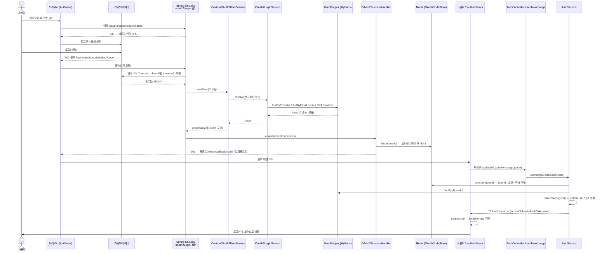

# 소셜 로그인(OAuth) 요청 따라가기 — Client → Provider → Server → DB

> **목적**: "카카오로 로그인" 버튼을 누르면 벌어지는 일을 끝까지 추적한다.
> 일반 이메일 로그인과 달리 **외부 제공자(카카오/네이버)** 와 **여러 번의 리다이렉트**가 끼어들기 때문에,
> [로그인 요청 따라가기(LOCAL)](login-flow-walkthrough.md) 를 먼저 읽고 오면 대비가 훨씬 잘 된다.
>
> 대상 흐름: **카카오/네이버 소셜 로그인** (Spring Security OAuth2 Client)
> 기준 브랜치: `main`

---

## 0. 큰 그림 — LOCAL 로그인과 무엇이 다른가

**LOCAL 로그인**은 요청 1건(아이디/비번 POST)으로 끝난다. **OAuth**는 "우리 서버가 비밀번호를 절대 보지 않고",
**제공자에게 신원 확인을 위임**한 뒤 그 결과만 받아온다. 그래서 브라우저가 여러 URL을 오간다.

```
                        ① 버튼 클릭 → 제공자로 이동
  [브라우저] ───────────────────────────────▶ [카카오/네이버 로그인·동의 화면]
      │                                                    │
      │  ⑤ 프론트 콜백(?code=일회용코드)                     │ ② 사용자가 로그인/동의
      ▼                                                    ▼
  [프론트 /oauth/callback]                        ③ 콜백 /login/oauth2/code/{provider}
      │                                                    │
      │  ⑥ POST /api/auth/oauth/exchange(코드)      [우리 서버 Spring Security]
      ▼                                              ④ 제공자에서 토큰·프로필 받아
  [우리 JWT 발급 = LOCAL 과 동일]  ◀──────────────    users 매핑 후 일회용 코드 발급
```

핵심 개념 3가지:
- **인증 위임**: 우리는 카카오/네이버가 "이 사람 맞다"고 확인해 준 결과(프로필)만 받는다. 비밀번호를 다루지 않는다.
- **하이브리드 계정 모델**: 소셜 계정도 결국 우리 `users` 테이블의 한 행이 된다(`provider`, `provider_id` 컬럼). 로그인 성공 후에는 **LOCAL과 완전히 같은 JWT 흐름**을 탄다.
- **일회용 코드 핸드오프**: JWT를 URL에 노출하지 않으려고, 성공 직후 짧은 수명의 "일회용 코드"만 프론트로 넘기고 프론트가 그 코드를 JWT로 교환한다.

---

## 1. 전체 흐름 (시퀀스 다이어그램)



> ③④ 구간(인가 코드 ↔ access token 교환, userInfo 조회)은 **Spring Security의 `oauth2Login` 필터가 자동으로** 처리한다. 우리가 직접 쓴 코드는 거기서 받은 프로필을 우리 `users`로 매핑하는 부분(CustomOAuth2UserService 이하)부터다.

---

## 2. 시작 — 프론트에서 제공자로 "이동"

**파일**: [tripcrew-frontend/src/views/AuthView.vue L173](../tripcrew-frontend/src/views/AuthView.vue#L173)

```html
<button type="button" class="social-btn social-btn--kakao" @click="socialLogin('kakao')"> ... </button>
<button type="button" class="social-btn social-btn--naver" @click="socialLogin('naver')"> ... </button>
```

```js
// AuthView.vue L320 — XHR(axios)가 아니라 브라우저 통째로 이동시킨다
function socialLogin(provider) {
  window.location.href = `${assetBaseURL}/oauth2/authorization/${provider}`
}
```

> **왜 `window.location.href`(전체 페이지 이동)인가?** OAuth는 제공자 로그인 화면으로 **실제로 이동**해야 한다.
> axios로 부르면 CORS·리다이렉트 처리가 안 된다. `assetBaseURL`은 `http://localhost:8080` (API baseURL에서 `/api`를 뗀 값).
> → 이동 목적지: `http://localhost:8080/oauth2/authorization/kakao`

`/oauth2/authorization/**` 와 콜백 `/login/oauth2/code/**` 는 [SecurityConfig L69](../tripcrew-backend/src/main/java/com/tripcrew/common/config/SecurityConfig.java#L69) 에서 `permitAll` — 로그인 전이라 당연히 공개.

---

## 3. Spring Security가 제공자로 리다이렉트

`/oauth2/authorization/kakao` 요청을 Spring Security의 **`oauth2Login` 필터**가 가로채, 설정된 카카오 인가 URL로 302 리다이렉트한다.

**설정**: [application.properties L93~L116](../tripcrew-backend/src/main/resources/application.properties#L93)
```properties
spring.security.oauth2.client.registration.kakao.client-id=${KAKAO_CLIENT_ID:...}
spring.security.oauth2.client.registration.kakao.client-secret=${KAKAO_CLIENT_SECRET:}
spring.security.oauth2.client.registration.kakao.client-authentication-method=client_secret_post
spring.security.oauth2.client.registration.kakao.redirect-uri={baseUrl}/login/oauth2/code/kakao
spring.security.oauth2.client.registration.kakao.scope=profile_nickname,account_email
spring.security.oauth2.client.provider.kakao.authorization-uri=https://kauth.kakao.com/oauth/authorize
spring.security.oauth2.client.provider.kakao.user-info-uri=https://kapi.kakao.com/v2/user/me
spring.security.oauth2.client.provider.kakao.user-name-attribute=id
```

- **`redirect-uri={baseUrl}/login/oauth2/code/kakao`**: `{baseUrl}`은 요청의 스킴/호스트로 치환된다.
  로컬은 `http://localhost:8080/...`, 운영은 `https://도메인/...`.
  > ⚠️ **여기가 도메인이 중요한 이유**: 제공자 콘솔에 등록된 Redirect URI와 이 값이 **정확히 일치**해야 한다.
  > 운영이 HTTP(IP)면 https 도메인 Redirect URI와 안 맞아 소셜 로그인이 막힌다. (도메인 붙이면 해결)

**STATELESS 대응**: 세션을 안 쓰므로, 리다이렉트 왕복 사이의 인가요청 상태를 **세션 대신 쿠키**에 보존한다.
→ [SecurityConfig L94~L99 `oauth2Login(...)`](../tripcrew-backend/src/main/java/com/tripcrew/common/config/SecurityConfig.java#L94) + [HttpCookieOAuth2AuthorizationRequestRepository](../tripcrew-backend/src/main/java/com/tripcrew/auth/oauth/HttpCookieOAuth2AuthorizationRequestRepository.java)

```java
.oauth2Login(oauth -> oauth
    .authorizationEndpoint(a -> a
        .authorizationRequestRepository(new HttpCookieOAuth2AuthorizationRequestRepository())) // 세션 대신 쿠키
    .userInfoEndpoint(u -> u.userService(customOAuth2UserService))  // 프로필 → users 매핑
    .successHandler(oAuth2SuccessHandler)   // 성공 → 일회용 코드
    .failureHandler(oAuth2FailureHandler))  // 실패 → 프론트로 에러코드
```

사용자는 이제 카카오/네이버 화면에서 로그인·동의를 한다. 끝나면 제공자가 우리 콜백 URL로 **인가 코드**를 붙여 되돌려보낸다.

---

## 4. 콜백 — 제공자 프로필을 우리 users로 매핑

콜백(`/login/oauth2/code/kakao?code=...`)이 오면, Spring Security가 **인가 코드로 access token을 교환하고 userInfo(프로필)를 조회**하는 것까지 자동으로 한다. 그 프로필을 받아 우리 도메인으로 잇는 게 아래 코드다.

### 4-1. 프로필 정규화 (제공자마다 응답 구조가 다르다)
**파일**: [OAuthAttributes.java](../tripcrew-backend/src/main/java/com/tripcrew/auth/oauth/OAuthAttributes.java)

카카오와 네이버는 표준 OIDC가 아니라 응답 JSON 구조가 제각각이라, 공통 형태로 변환한다:
- **Kakao** ([L35](../tripcrew-backend/src/main/java/com/tripcrew/auth/oauth/OAuthAttributes.java#L35)): `id`는 최상위, 이메일/검증여부는 `kakao_account` 안에 중첩, 닉네임은 그 안 `profile`.
- **Naver** ([L53](../tripcrew-backend/src/main/java/com/tripcrew/auth/oauth/OAuthAttributes.java#L53)): 모든 값이 `response` 객체로 한 번 감싸져 있음.
  ```java
  // 네이버 이메일은 '연락처 이메일'이라 소유권 검증값이 아님 → emailVerified=false 로 둔다
  // (기존 계정과 이메일이 겹쳐도 자동 연동하지 않음 = 계정 탈취 방지). 식별은 고유한 response.id 로.
  return new OAuthAttributes(Provider.NAVER, id, email, nickname, false);
  ```

### 4-2. userInfo 수신 → 매핑 진입점
**파일**: [CustomOAuth2UserService.java L33](../tripcrew-backend/src/main/java/com/tripcrew/auth/oauth/CustomOAuth2UserService.java#L33)

```java
public OAuth2User loadUser(OAuth2UserRequest userRequest) {
    OAuth2User oAuth2User = super.loadUser(userRequest);          // Spring 이 받아온 원본 프로필
    OAuthAttributes attributes = OAuthAttributes.of(registrationId, oAuth2User.getAttributes()); // 정규화
    User user = oAuth2LoginService.resolve(attributes);           // ← 우리 users 로 조회/연동/생성
    // 성공 핸들러가 읽을 수 있게 우리 DB user id 를 principal 속성에 실어 반환
    principalAttributes.put(TRIPCREW_USER_ID, user.getId());
    return new DefaultOAuth2User(권한, principalAttributes, nameAttributeKey);
}
```

### 4-3. 계정 조회/연동/신규가입 정책
**파일**: [OAuth2LoginService.java L37 `resolve()`](../tripcrew-backend/src/main/java/com/tripcrew/auth/oauth/OAuth2LoginService.java#L37)

순서대로 4가지 케이스를 처리한다:
1. **이미 연동된 소셜 계정** (`(provider, provider_id)` 일치) → 그 계정으로 로그인. [L40](../tripcrew-backend/src/main/java/com/tripcrew/auth/oauth/OAuth2LoginService.java#L40)
2. **이메일이 없으면** 거부(식별·연동 불가). [L46](../tripcrew-backend/src/main/java/com/tripcrew/auth/oauth/OAuth2LoginService.java#L46)
3. **같은 이메일의 기존 계정이 있으면** → **검증된 이메일 + ACTIVE**일 때만 자동 연동(`linkProvider`). 정지/탈퇴 계정은 소셜로 되살리지 않음. [L52](../tripcrew-backend/src/main/java/com/tripcrew/auth/oauth/OAuth2LoginService.java#L52)
4. **그 외** → 비밀번호 없는(`password=null`) 소셜 전용 계정 신규 생성. [L70](../tripcrew-backend/src/main/java/com/tripcrew/auth/oauth/OAuth2LoginService.java#L70)

관련 SQL: [UserMapper.xml](../tripcrew-backend/src/main/resources/mappers/user/UserMapper.xml) 의
`findByProvider` ([L17](../tripcrew-backend/src/main/resources/mappers/user/UserMapper.xml#L17)) · `linkProvider` ([L78](../tripcrew-backend/src/main/resources/mappers/user/UserMapper.xml#L78)) · `insert` ([L29](../tripcrew-backend/src/main/resources/mappers/user/UserMapper.xml#L29))

> ⚠️ **한계(단순화)**: `users`는 `(provider, provider_id)` 한 쌍만 가져 계정당 소셜 1개만 연동된다.
> 같은 이메일로 두 소셜을 쓰면 마지막 로그인한 제공자로 연동이 덮인다. 다중 연동이 필요하면
> 별도 `user_social_accounts`(1:N) 테이블로 확장(백로그). 여기서 `password=null`이 소셜 계정의 표식이 되어,
> LOCAL 비번 로그인([AuthService.login L70](../tripcrew-backend/src/main/java/com/tripcrew/auth/service/AuthService.java#L70))·비번변경 등에서 분기된다.

---

## 5. 성공 → 일회용 코드 발급 → 프론트로 리다이렉트

**파일**: [OAuth2SuccessHandler.java L32](../tripcrew-backend/src/main/java/com/tripcrew/auth/oauth/OAuth2SuccessHandler.java#L32)

```java
public void onAuthenticationSuccess(...) {
    Long userId = (Long) principal.getAttributes().get(TRIPCREW_USER_ID); // 4-2 에서 실은 값
    String code = codeStore.issue(userId);                                // 일회용 코드 발급(Redis)
    String target = UriComponentsBuilder.fromUriString(redirectBase)      // = app.oauth2.success-redirect-base
            .path("/oauth/callback").queryParam("code", code).build().toUriString();
    getRedirectStrategy().sendRedirect(request, response, target);        // 프론트 콜백으로 302
}
```

**일회용 코드 저장소**: [OAuthCodeStore.java](../tripcrew-backend/src/main/java/com/tripcrew/auth/oauth/OAuthCodeStore.java)
```java
private static final Duration TTL = Duration.ofSeconds(60);   // 60초 수명
public String issue(Long userId) {  // UUID 코드 → Redis 에 저장(userId, TTL 60s)
    ...
}
public Optional<Long> consume(String code) {  // getAndDelete → 1회만 유효(재사용 차단)
    String userId = redisTemplate.opsForValue().getAndDelete(KEY_PREFIX + code);
    ...
}
```

> **왜 JWT를 URL에 안 싣고 일회용 코드를 쓰나?** access/refresh 토큰을 `?token=...`으로 넘기면
> 브라우저 히스토리·리퍼러·서버 로그에 토큰이 남아 유출 위험이 크다. 대신 **60초·1회용 코드**만 URL로 넘기고,
> 프론트가 그 코드를 안전한 POST로 진짜 토큰과 교환한다. 코드가 새어도 60초·1회 제한이라 피해가 작다.

**리다이렉트 목적지**: [application.properties L88](../tripcrew-backend/src/main/resources/application.properties#L88)
```properties
app.oauth2.success-redirect-base=${APP_OAUTH_REDIRECT_BASE:http://localhost:5173}
```
→ 로컬은 `http://localhost:5173/oauth/callback?code=...`, 운영은 이 env를 운영 도메인으로 바꿔야 한다.

**실패 시**: [OAuth2FailureHandler.java](../tripcrew-backend/src/main/java/com/tripcrew/auth/oauth/OAuth2FailureHandler.java) 가 `?error=코드`를 붙여 같은 콜백으로 보낸다(원인은 서버 로그, 사용자에겐 코드만).

---

## 6. 프론트 콜백 → 코드를 JWT로 교환

**파일**: [OAuthCallbackView.vue L53](../tripcrew-frontend/src/views/OAuthCallbackView.vue#L53) (라우트 `/oauth/callback` → [router/index.js L17](../tripcrew-frontend/src/router/index.js#L17))

```js
onMounted(async () => {
  const error = route.query.error, code = route.query.code
  if (error) { errorMessage.value = messageFor(error); return }   // 실패 안내
  if (!code) { errorMessage.value = messageFor(); return }
  try {
    await authStore.loginWithOAuthCode(code)   // ← 코드 교환
    router.replace(redirectTarget())           // 성공 → /home 또는 /admin
  } catch { errorMessage.value = messageFor() }
})
```

store의 [`loginWithOAuthCode` (auth.js L53)](../tripcrew-frontend/src/stores/auth.js#L53) 는 코드를 교환하고, 그 결과를 **LOCAL 로그인과 똑같은 `setSession`** 으로 저장한다:
```js
async function loginWithOAuthCode(code) {
  return setSession(await authApi.oauthExchange(code))  // api/auth.js L14: POST /auth/oauth/exchange {code}
}
```

---

## 7. 서버 — 코드 교환 (여기서부터 LOCAL과 합류)

**파일**: [AuthController.java L53](../tripcrew-backend/src/main/java/com/tripcrew/auth/controller/AuthController.java#L53) → [AuthService.exchangeOAuthCode L100](../tripcrew-backend/src/main/java/com/tripcrew/auth/service/AuthService.java#L100)

```java
@PostMapping("/oauth/exchange")   // /api/auth/oauth/exchange — SecurityConfig L66 에서 permitAll
public TokenResponse exchangeOAuth(@Valid @RequestBody OAuthExchangeRequest request) {
    return authService.exchangeOAuthCode(request.code());
}

// AuthService L100
public TokenResponse exchangeOAuthCode(String code) {
    Long userId = oAuthCodeStore.consume(code)        // 코드 소비(1회, 즉시 삭제)
            .orElseThrow(InvalidTokenException::new);
    User user = userMapper.findById(userId).orElseThrow(InvalidTokenException::new);
    ensureActive(user);                               // 밴/탈퇴/정지 확인 (LOCAL 과 동일)
    return issueTokens(user);                         // ★ LOCAL 로그인과 완전히 같은 토큰 발급
}
```

> **여기서부터는 LOCAL 로그인과 동일**하다. [issueTokens](../tripcrew-backend/src/main/java/com/tripcrew/auth/service/AuthService.java#L196) 가 access/refresh JWT를 만들고 refresh를 `refresh_tokens` 테이블에 저장한다.
> 이후 모든 보호 요청의 인증([JwtAuthenticationFilter](../tripcrew-backend/src/main/java/com/tripcrew/auth/jwt/JwtAuthenticationFilter.java))·재발급도 LOCAL과 똑같다.
> → 자세한 내용은 [로그인 워크스루 §4-3·§5·§6](login-flow-walkthrough.md) 참고.

프론트는 받은 `TokenResponse`를 `setSession`으로 저장하고 화면을 이동한다. 이 시점부터 "소셜로 들어온 사용자"와 "이메일로 들어온 사용자"는 구분 없이 동일하게 동작한다.

---

## 8. DB — 소셜 관련 컬럼
소셜 로그인은 새 테이블이 아니라 **`users`에 컬럼 3개를 더한 것**이다 (마이그레이션 `V17__add_user_oauth.sql`):

| 컬럼 | 의미 |
|------|------|
| `provider` | `LOCAL` \| `KAKAO` \| `NAVER` (기본 `LOCAL`) |
| `provider_id` | 제공자 쪽 고유 사용자 ID (소셜 계정 식별·연동 키). LOCAL이면 `NULL` |
| `password` | **V17에서 `NULL` 허용으로 변경** — 소셜 전용 계정은 비번이 없음 |

`(provider, provider_id)` 조합으로 소셜 계정을 식별한다. 나머지(id·email·role·status·refresh_tokens)는 LOCAL과 공유.

---

## 9. 운영에서 소셜 로그인을 되살리려면 (도메인 붙일 때 체크리스트)

현재 운영은 HTTPS 인증서 장애로 **HTTP(IP)로 응급복구** 중이라 소셜 로그인이 꺼져 있다. 도메인+HTTPS를 붙이면:

1. **가비아 등에서 도메인 구매** → A레코드 `@`·`www` → `54.116.249.81`
2. **EC2 Caddyfile** `:80` → 새 도메인으로 (Caddy가 Let's Encrypt 인증서 자동 발급) → web 재빌드
3. **제공자 콘솔 Redirect URI** 추가:
   - `https://새도메인/login/oauth2/code/kakao`
   - `https://새도메인/login/oauth2/code/naver`
4. **EC2 `.env`** 교체 후 재기동:
   - `APP_OAUTH_REDIRECT_BASE=https://새도메인` (§5의 성공 리다이렉트 목적지)
   - `APP_CORS_ORIGINS=https://새도메인`

> §3의 `redirect-uri={baseUrl}`이 자동으로 `https://새도메인/...`이 되고, 콘솔 등록값과 일치하면 복구 완료.

---

## 부록: OAuth 흐름에 등장한 파일 지도

| 단계 | 역할 | 파일 |
|------|------|------|
| ① 시작 | 소셜 버튼 / 제공자로 이동 | [AuthView.vue L320](../tripcrew-frontend/src/views/AuthView.vue#L320) |
| ②③ 설정 | oauth2Login 필터 · 쿠키 저장소 | [SecurityConfig.java L94](../tripcrew-backend/src/main/java/com/tripcrew/common/config/SecurityConfig.java#L94) · [HttpCookie...Repository](../tripcrew-backend/src/main/java/com/tripcrew/auth/oauth/HttpCookieOAuth2AuthorizationRequestRepository.java) |
| ③ 설정값 | 제공자 등록/스코프/redirect-uri | [application.properties L88~L116](../tripcrew-backend/src/main/resources/application.properties#L88) |
| ④ 정규화 | 제공자별 프로필 파싱 | [OAuthAttributes.java](../tripcrew-backend/src/main/java/com/tripcrew/auth/oauth/OAuthAttributes.java) |
| ④ 매핑 진입 | userInfo → 우리 도메인 | [CustomOAuth2UserService.java L33](../tripcrew-backend/src/main/java/com/tripcrew/auth/oauth/CustomOAuth2UserService.java#L33) |
| ④ 계정 정책 | 조회/연동/신규가입 | [OAuth2LoginService.java L37](../tripcrew-backend/src/main/java/com/tripcrew/auth/oauth/OAuth2LoginService.java#L37) |
| ⑤ 성공 | 일회용 코드 발급·리다이렉트 | [OAuth2SuccessHandler.java](../tripcrew-backend/src/main/java/com/tripcrew/auth/oauth/OAuth2SuccessHandler.java) |
| ⑤ 코드 저장 | Redis 1회용 코드 | [OAuthCodeStore.java](../tripcrew-backend/src/main/java/com/tripcrew/auth/oauth/OAuthCodeStore.java) |
| 실패 | 에러코드 리다이렉트 | [OAuth2FailureHandler.java](../tripcrew-backend/src/main/java/com/tripcrew/auth/oauth/OAuth2FailureHandler.java) |
| ⑥ 콜백 | 코드 → JWT 교환 화면 | [OAuthCallbackView.vue L53](../tripcrew-frontend/src/views/OAuthCallbackView.vue#L53) · [stores/auth.js L53](../tripcrew-frontend/src/stores/auth.js#L53) |
| ⑦ 교환 | 코드 소비 → JWT 발급(LOCAL 합류) | [AuthController.java L53](../tripcrew-backend/src/main/java/com/tripcrew/auth/controller/AuthController.java#L53) · [AuthService.java L100](../tripcrew-backend/src/main/java/com/tripcrew/auth/service/AuthService.java#L100) |
| DB | 소셜 컬럼 | `users.provider` / `provider_id` / `password(nullable)` (V17) |

---

> 📌 이 문서의 짝꿍: [로그인 요청 따라가기 (LOCAL 이메일+비밀번호)](login-flow-walkthrough.md)
